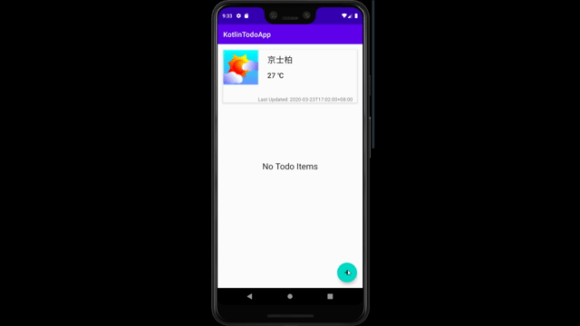

# kotlin-todoApp

## Purpose
This is a mobile app for serving purpose for CRUD operations on TodoItems and getWeather from Hong Kong Observatory

## WalkThrough

## TODO
- [] add GPS to check current location
- [] Unit Testing 
- [x] CRUD operation including insert, update, delete, get from Room
- [x] Get Weather from HKO OpenData API (https://data.gov.hk/tc-datasets/provider/hk-hko)

## Platform
 - Android
 
## Language
- Kotlin

## Architecture
- Android MVVM 
- Androidx Navigation
- Koin

## Database
- Android Room

## Image Processing
- Glide

## Networking
- Retrofit
- OkHttp
- Corroutines

